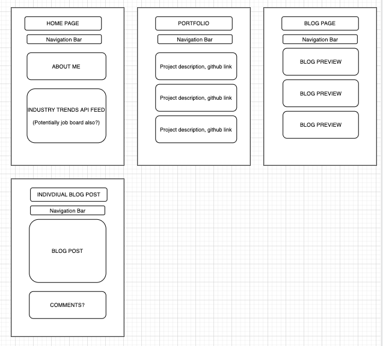
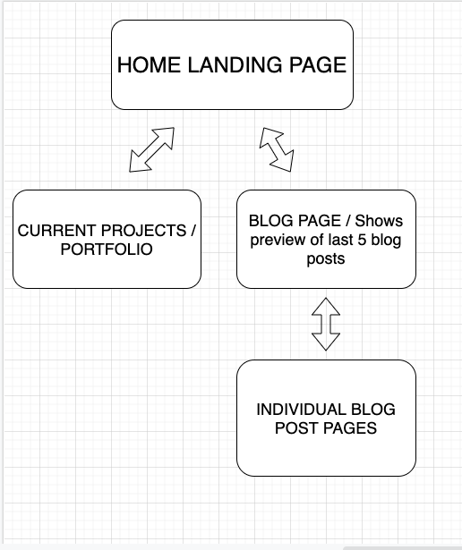

# Tech NewsReader

## Project Description

- I am going to create a personal blog / portfolio that allows me to showcase my journey as I "learn to code" and move into the tech field. My components will be a home landing page, a blog page showing recent posts (posts will initially be housed on dev.to and API fetched from there) and a newsfeed of current trends in the tech industry via Hacker News API.

## Project Link

- To go here...

## Big Notes

- Hard push to early MVP, CSS/styling to begin after.  Workflow will first target the Home landing page + NewsReader, followed by the blog imports from dev.to.

## User Stories

- As a user, I want a navigation bar on the landing page, so that I can move around the site.
- As a user, I want to be able to display a list of current articles from Hacker News.
- As a user, I want a selection of buttons that will read each topic, so I can select what to search.

## Bronze Features

- As a user, I want to be able to search for topics via a searchbar, so I can query a wider variety of articles.

## Silver Features

- As a user, I want to be able to navigate to a blog page, so I can read what the creator has written.

## Gold Features

- As a user, I want to be able to navigate to a page of that displays the creator's portfolio, in case I want to hire him.
- As a user, I want to be able to click on each blog post title, so I can read the entire article. (dev.to API)

## Wire Frame

- 

## Flow Chart

- 

## Technologies Used

- React
- HTML
- CSS
- Javascript

## Installation Instructions

- Fork Repo
- Clone it
- To contribute please make pull request!

## Embedded App Screenshot

- TBD

## Unsolved Problems, Major Hurdles, and Reflections Along the Way...

- TBD

## Next Steps

- TBD